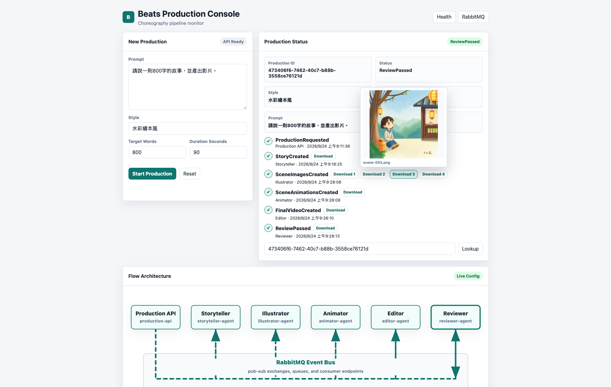

# Beats Production Choreography Demo

Language: [English](#english) | [中文](#中文)

---

## English

This repository is a local Docker demo for an event-driven AI production pipeline.

The demo uses RabbitMQ as the event bus, Azurite as the local Azure Blob Storage emulator, MySQL as the local database, and six .NET 8 services:

```text
Production.Api
Agents.Storyteller
Agents.Illustrator
Agents.Animator
Agents.Editor
Agents.Reviewer
```

The workflow is choreography-based. Each agent subscribes to the event it cares about, does its own work, writes records to MySQL, writes text artifacts to Azurite, and publishes the next event.





### Requirements

Only Docker is required.

You do not need to install:

```text
.NET SDK
Azure CLI
MySQL client
RabbitMQ
Azurite
```

### Start The Demo

From the repository root:

```bash
docker compose up -d --build
```

Check all containers:

```bash
docker compose ps
```

Expected long-running services:

```text
beats-production-api
beats-storyteller-agent
beats-illustrator-agent
beats-animator-agent
beats-editor-agent
beats-reviewer-agent
beats-rabbitmq
beats-azurite
beats-mysql
```

The `beats-storage-init` and `beats-mysql-init` containers are one-time initialization jobs. It is normal for them to exit with status `0`.

### Local Ollama

Ollama is not included in Docker compose. It is treated as an external AI service. The API and agents running inside Docker call Ollama on the Mac through:

```text
http://host.docker.internal:11434
```

The default model settings are in `.env.example` and `compose.yaml`:

```text
OLLAMA_BASE_URL=http://host.docker.internal:11434
OLLAMA_MODEL=llama3.1:8b
OLLAMA_TIMEOUT_SECONDS=120
OLLAMA_TEMPERATURE=0.7
OLLAMA_NUM_PREDICT=2048
STORYTELLER_OLLAMA_MODEL=hf.co/yuxinlu1/gemma-4-12B-agentic-fable5-composer2.5-v2-3.5x-tau2-GGUF:Q4_K_M
STORYTELLER_OLLAMA_TIMEOUT_SECONDS=900
STORYTELLER_OLLAMA_NUM_PREDICT=8192
```

`OLLAMA_MODEL` is the default model. Storyteller overrides it with `STORYTELLER_OLLAMA_MODEL` for story generation.

When running .NET directly on the host instead of through Docker, `OllamaOptions` defaults to:

```text
http://localhost:11434
```

Check the local Ollama service:

```bash
curl -s http://127.0.0.1:11434/api/tags
```

### Local ComfyUI / FLUX

ComfyUI is not included in Docker compose. Like Ollama, it is treated as an external AI service. The Illustrator agent calls ComfyUI to generate scene image artifacts.

The Illustrator container calls ComfyUI on the Mac through:

```text
http://host.docker.internal:8188
```

The default setup uses FLUX.1 schnell GGUF quantized:

```text
COMFYUI_BASE_URL=http://host.docker.internal:8188
COMFYUI_MODEL=flux1-schnell-Q4_K_S.gguf
COMFYUI_CLIP_NAME1=clip_l.safetensors
COMFYUI_CLIP_NAME2=t5xxl_fp8_e4m3fn.safetensors
COMFYUI_VAE_NAME=ae.safetensors
COMFYUI_WIDTH=768
COMFYUI_HEIGHT=768
COMFYUI_STEPS=4
COMFYUI_GUIDANCE=3.5
COMFYUI_MAX_SCENES=3
```

When running .NET directly on the host instead of through Docker, Illustrator's `ComfyUI:BaseUrl` defaults to:

```text
http://127.0.0.1:8188
```

Check the local ComfyUI service:

```bash
curl -s http://127.0.0.1:8188/system_stats
```

### Use The UI

Open:

```text
http://localhost:5088
```

The page can start a production, poll its status, show the production id, and link to the RabbitMQ management UI.

### Test The API

Create a production:

```bash
curl -s -X POST http://127.0.0.1:5088/productions \
  -H 'Content-Type: application/json' \
  -d '{
    "prompt": "請說一則800字的故事，並產出影片。",
    "style": "水彩繪本風",
    "targetWordCount": 800,
    "durationSeconds": 90
  }'
```

If your host does not have `curl`, run the request from a temporary Docker container:

```bash
docker run --rm --network beats_default curlimages/curl:8.10.1 \
  -s -X POST http://production-api:8080/productions \
  -H 'Content-Type: application/json' \
  -d '{
    "prompt": "請說一則800字的故事，並產出影片。",
    "style": "水彩繪本風",
    "targetWordCount": 800,
    "durationSeconds": 90
  }'
```

The response contains a `productionId`:

```json
{
  "productionId": "00000000-0000-0000-0000-000000000000",
  "eventId": "00000000-0000-0000-0000-000000000000",
  "status": "Requested"
}
```

Use that `productionId` to check status:

```bash
curl -s http://127.0.0.1:5088/productions/{productionId}
```

After a few seconds, the expected final status is:

```text
ReviewPassed
```

Expected event chain:

```text
ProductionRequested
  -> StoryCreated
  -> SceneImagesCreated
  -> SceneAnimationsCreated
  -> FinalVideoCreated
  -> ReviewPassed
```

Test the project's Ollama text generation client:

```bash
curl -s -X POST http://127.0.0.1:5088/ai/text-generations \
  -H 'Content-Type: application/json' \
  -d '{
    "prompt": "Answer in one short sentence: is local Ollama connected?",
    "temperature": 0.2
  }'
```

### Watch Logs

Follow all .NET service logs:

```bash
docker compose logs -f production-api storyteller-agent illustrator-agent animator-agent editor-agent reviewer-agent
```

Follow one service:

```bash
docker compose logs -f storyteller-agent
```

### Check MySQL Records

Open a MySQL shell inside the container:

```bash
docker exec -it beats-mysql mysql -uroot -pbeats-root-dev beats
```

Useful SQL queries:

```sql
SELECT ProductionId, Status, CreatedAt, UpdatedAt
FROM Productions
ORDER BY CreatedAt DESC
LIMIT 5;

SELECT EventType, Producer, CreatedAt
FROM ProductionEvents
WHERE ProductionId = '{productionId}'
ORDER BY CreatedAt;

SELECT AgentRole, ArtifactUri, MediaType, CreatedAt
FROM Artifacts
WHERE ProductionId = '{productionId}'
ORDER BY CreatedAt;

SELECT AgentRole, Status, InputArtifactUri, OutputArtifactUri, StartedAt, CompletedAt
FROM AgentRuns
WHERE ProductionId = '{productionId}'
ORDER BY StartedAt;
```

Or run a one-shot query from your host:

```bash
docker exec beats-mysql mysql -uroot -pbeats-root-dev beats \
  -e "SELECT ProductionId, Status, CreatedAt FROM Productions ORDER BY CreatedAt DESC LIMIT 5;"
```

You can also connect with a GUI database client such as DBeaver, TablePlus, or MySQL Workbench:

```text
Host:     127.0.0.1
Port:     3306
Database: beats
User:     root
Password: beats-root-dev
```

### Check Azurite Artifacts

Each agent writes a new text artifact version:

```text
productions/{productionId}/01-storyteller/manuscript.txt
productions/{productionId}/02-illustrator/manuscript.txt
productions/{productionId}/03-animator/manuscript.txt
productions/{productionId}/04-editor/manuscript.txt
productions/{productionId}/05-reviewer/manuscript.txt
```

List artifacts with Docker only:

```bash
docker compose run --rm --no-deps storage-init \
  sh -c 'az storage blob list \
    --container-name artifacts \
    --connection-string "$AZURE_STORAGE_CONNECTION_STRING" \
    --prefix productions/{productionId} \
    --query "[].name" \
    -o tsv'
```

Download the final reviewer artifact:

```bash
docker compose run --rm --no-deps -v "$PWD:/workspace" storage-init \
  sh -c 'az storage blob download \
    --container-name artifacts \
    --name productions/{productionId}/05-reviewer/manuscript.txt \
    --file /workspace/final-manuscript.txt \
    --connection-string "$AZURE_STORAGE_CONNECTION_STRING" \
    --overwrite'
```

You can also inspect Azurite with Azure Storage Explorer. Use the local emulator connection option, or copy the Azurite connection string from `compose.yaml` and replace the internal `azurite` host with `127.0.0.1`.

Blob container:

```text
artifacts
```

Artifact path:

```text
productions/{productionId}/
```

### RabbitMQ Management UI

Open:

```text
http://localhost:15672
```

Credentials:

```text
username: beats
password: beats-dev
vhost: beats
```

### Service Ports

```text
Production API: http://localhost:5088
RabbitMQ AMQP: localhost:5672
RabbitMQ UI:   http://localhost:15672
Azurite Blob:  http://localhost:10000
Azurite Queue: http://localhost:10001
Azurite Table: http://localhost:10002
MySQL:         localhost:3306
```

### Stop Or Reset

Stop containers but keep persisted RabbitMQ, Azurite, and MySQL data:

```bash
docker compose down
```

Stop containers and remove persisted volumes:

```bash
docker compose down -v
```

Rebuild after code changes:

```bash
docker compose up -d --build
```

### Flow Config

The choreography flow is defined in:

```text
flows/production-flow.json
```

This file is mounted into every .NET service at `/app/flows`. If you only change agent subscriptions/publications in the flow config, you do not need to rebuild; restart the related services instead:

```bash
docker compose restart production-api storyteller-agent illustrator-agent animator-agent editor-agent reviewer-agent
```

#### DI and Choreography Decoupling

`production-flow.json` is the flow topology source for this demo. It describes which events each role subscribes to and which events it publishes after completing work. An agent does not need to know which agent comes next.

The responsibilities are separated like this:

- `Production.Contracts` defines shared event payloads and contracts, which are the common rules every service follows.
- `Production.Flows` loads `production-flow.json` and registers `IProductionFlow` through dependency injection, so the API and agents can query the active flow through an abstraction.
- `Production.Middleware` provides shared infrastructure adapters for RabbitMQ, artifact storage, and the database.
- Each `Agents.*` project keeps only its own capability implementation, such as storytelling, illustration, animation, editing, or review. It does not own the flow topology.

At startup, each agent declares only its role, such as `storyteller-agent`. `Production.Flows` reads `production-flow.json`, finds that role's subscriptions, scans the agent assembly for the matching MassTransit consumer, and registers it through DI. After a consumer finishes its work, it asks `IProductionFlow` which event type to publish next instead of hardcoding the flow name inside the agent.

This keeps the system in a choreography style:

- There is no central orchestrator calling agents one by one.
- The API and agents only publish events to the RabbitMQ event bus.
- Agents react only to the events they subscribe to.
- The flow order is controlled by `production-flow.json`.
- Changing subscription/publication topology usually means editing config and restarting related services, not recompiling code.

Note: RabbitMQ queue bindings and MassTransit consumer topology are created when each service starts, so subscription changes still require a service restart.

### Project Layout

```text
flows/production-flow.json  Choreography configuration file
src/Production.Api          API and UI for starting and checking productions
src/Production.Contracts    Shared events, payloads, and contracts
src/Production.Flows        Choreography rules for agent subscriptions and publications
src/Production.Middleware   Shared event bus, artifact, and persistence adapters
src/Agents.Storyteller      Storyteller capability; subscriptions/publications are loaded from Production.Flows
src/Agents.Illustrator      Illustrator capability; subscriptions/publications are loaded from Production.Flows
src/Agents.Animator         Animator capability; subscriptions/publications are loaded from Production.Flows
src/Agents.Editor           Editor capability; subscriptions/publications are loaded from Production.Flows
src/Agents.Reviewer         Reviewer capability; subscriptions/publications are loaded from Production.Flows
sql/                        Database schema
docs/                       Extra local operation notes
```

### Notes

This is a dummy pipeline. The current agents enrich a text artifact so the choreography, pub-sub integration, persistence, and artifact flow can be tested end to end.

Real AI generation can later be added inside each agent without changing the integration shape.

All credentials in `compose.yaml`, `.env.example`, and this README are local demo defaults only. Do not reuse them for cloud resources or shared environments.

---

## 中文

這是一個本機 Docker demo，用來展示 event-driven choreography 的 AI production pipeline。

整套 demo 使用 RabbitMQ 作為 event bus、Azurite 作為本機 Azure Blob Storage emulator、MySQL 作為本機資料庫，並包含六個 .NET 8 服務：

```text
Production.Api
Agents.Storyteller
Agents.Illustrator
Agents.Animator
Agents.Editor
Agents.Reviewer
```

流程採 choreography 架構。每個 agent 只訂閱自己關心的事件，完成自己的工作後寫入 MySQL、產出 artifact 到 Azurite，然後發布下一個事件。


### Flow Config

choreography 流程定義在：

```text
flows/production-flow.json
```

這個檔案會 mount 到每個 .NET service 的 `/app/flows`。如果只調整 agent 訂閱/發布的 flow config，不需要重新編譯；修改後 restart 相關服務即可：

```bash
docker compose restart production-api storyteller-agent illustrator-agent animator-agent editor-agent reviewer-agent
```

#### DI 與 choreography 解耦合設計

`production-flow.json` 是這個 demo 的流程拓樸來源。它描述每個角色會訂閱哪些 event，以及在處理完成後會發布哪些 event；agent 本身不需要知道下一個 agent 是誰。

設計分工如下：

- `Production.Contracts` 定義事件 payload 與共用 contract，也就是所有服務共同遵守的「遊戲規則」。
- `Production.Flows` 讀取 `production-flow.json`，並透過 DI 註冊 `IProductionFlow`，讓 API 與 agents 透過抽象介面查詢目前流程。
- `Production.Middleware` 提供 RabbitMQ、artifact storage、database 等共用基礎設施 adapters。
- 各 `Agents.*` project 只保留自己的能力實作，例如說書、繪圖、動畫、剪輯、審查，不直接保存流程拓樸。

啟動時，每個 agent 只宣告自己的 role，例如 `storyteller-agent`。`Production.Flows` 會依照 `production-flow.json` 找出該 role 的 subscriptions，掃描 agent assembly 中對應的 MassTransit consumer，並透過 DI 註冊到 RabbitMQ。consumer 完成工作後，也會透過 `IProductionFlow` 查詢下一個要發布的 event type，而不是在 agent 內 hard code 流程名稱。

這讓整體流程維持 choreography 架構：

- 沒有中央 orchestrator 逐步呼叫每個 agent。
- API 與 agents 只發布 event 到 RabbitMQ event bus。
- agents 只根據自己訂閱到的 event 反應。
- 流程順序由 `production-flow.json` 決定。
- 修改訂閱/發布拓樸時，通常只要更新 config 並 restart 相關服務，不需要重新編譯。

注意：RabbitMQ queue binding 與 MassTransit consumer topology 是在 service 啟動時建立，因此變更 subscriptions 後仍需要 restart service 才會生效。

### 專案結構

```text
flows/production-flow.json  choreography 設定檔
src/Production.Api          建立與查詢 productions 的 API / UI
src/Production.Contracts    共用 events、payloads、contracts
src/Production.Flows        choreography 流程規則，定義 agent 訂閱與發布拓樸
src/Production.Middleware   共用 event bus、artifact、persistence adapters
src/Agents.Storyteller      說書人能力實作，訂閱/發布由 Production.Flows 載入
src/Agents.Illustrator      繪圖師能力實作，訂閱/發布由 Production.Flows 載入
src/Agents.Animator         動畫師能力實作，訂閱/發布由 Production.Flows 載入
src/Agents.Editor           剪輯師能力實作，訂閱/發布由 Production.Flows 載入
src/Agents.Reviewer         審查者能力實作，訂閱/發布由 Production.Flows 載入
sql/                        database schema
docs/                       額外本機操作文件
```

### 需求

只需要 Docker。

不需要額外安裝：

```text
.NET SDK
Azure CLI
MySQL client
RabbitMQ
Azurite
```

### 啟動 Demo

在 repo 根目錄執行：

```bash
docker compose up -d --build
```

查看 container 狀態：

```bash
docker compose ps
```

預期會看到這些長時間執行的服務：

```text
beats-production-api
beats-storyteller-agent
beats-illustrator-agent
beats-animator-agent
beats-editor-agent
beats-reviewer-agent
beats-rabbitmq
beats-azurite
beats-mysql
```

`beats-storage-init` 和 `beats-mysql-init` 是一次性的初始化 job，結束並顯示 `Exited (0)` 是正常的。

### 本機 Ollama

Ollama 不會被包進 Docker compose；它被視為外部 AI 服務。Docker 裡的 API 與 agents 預設透過這個位址呼叫 Mac 上的 Ollama：

```text
http://host.docker.internal:11434
```

預設模型設定在 `.env.example` 與 `compose.yaml`：

```text
OLLAMA_BASE_URL=http://host.docker.internal:11434
OLLAMA_MODEL=llama3.1:8b
OLLAMA_TIMEOUT_SECONDS=120
OLLAMA_TEMPERATURE=0.7
OLLAMA_NUM_PREDICT=2048
STORYTELLER_OLLAMA_MODEL=hf.co/yuxinlu1/gemma-4-12B-agentic-fable5-composer2.5-v2-3.5x-tau2-GGUF:Q4_K_M
STORYTELLER_OLLAMA_TIMEOUT_SECONDS=900
STORYTELLER_OLLAMA_NUM_PREDICT=8192
```

`OLLAMA_MODEL` 是預設模型；Storyteller 會使用 `STORYTELLER_OLLAMA_MODEL` 覆蓋成故事生成專用模型。

如果直接在本機跑 .NET，不透過 Docker，`OllamaOptions` 的預設 `BaseUrl` 是：

```text
http://localhost:11434
```

確認 Ollama 本機服務：

```bash
curl -s http://127.0.0.1:11434/api/tags
```

### 本機 ComfyUI / FLUX

ComfyUI 不會被包進 Docker compose；它和 Ollama 一樣被視為外部 AI 服務。Illustrator agent 會呼叫 ComfyUI 產生 scene image artifacts。

Docker 裡的 Illustrator 預設透過這個位址呼叫 Mac 上的 ComfyUI：

```text
http://host.docker.internal:8188
```

目前預設使用 FLUX.1 schnell GGUF quantized：

```text
COMFYUI_BASE_URL=http://host.docker.internal:8188
COMFYUI_MODEL=flux1-schnell-Q4_K_S.gguf
COMFYUI_CLIP_NAME1=clip_l.safetensors
COMFYUI_CLIP_NAME2=t5xxl_fp8_e4m3fn.safetensors
COMFYUI_VAE_NAME=ae.safetensors
COMFYUI_WIDTH=768
COMFYUI_HEIGHT=768
COMFYUI_STEPS=4
COMFYUI_GUIDANCE=3.5
COMFYUI_MAX_SCENES=3
```

如果直接在本機跑 .NET，不透過 Docker，Illustrator 的 `ComfyUI:BaseUrl` 預設是：

```text
http://127.0.0.1:8188
```

確認 ComfyUI 本機服務：

```bash
curl -s http://127.0.0.1:8188/system_stats
```

### 使用 UI

開啟：

```text
http://localhost:5088
```

UI 可以建立 production、自動輪詢 production 狀態、查看 production id，並連到 RabbitMQ Management UI。

### 測試 API

建立一筆 production：

```bash
curl -s -X POST http://127.0.0.1:5088/productions \
  -H 'Content-Type: application/json' \
  -d '{
    "prompt": "請說一則800字的故事，並產出影片。",
    "style": "水彩繪本風",
    "targetWordCount": 800,
    "durationSeconds": 90
  }'
```

如果你的主機沒有 `curl`，可以用暫時的 Docker container 發 request：

```bash
docker run --rm --network beats_default curlimages/curl:8.10.1 \
  -s -X POST http://production-api:8080/productions \
  -H 'Content-Type: application/json' \
  -d '{
    "prompt": "請說一則800字的故事，並產出影片。",
    "style": "水彩繪本風",
    "targetWordCount": 800,
    "durationSeconds": 90
  }'
```

回應會包含 `productionId`：

```json
{
  "productionId": "00000000-0000-0000-0000-000000000000",
  "eventId": "00000000-0000-0000-0000-000000000000",
  "status": "Requested"
}
```

查詢 production 狀態：

```bash
curl -s http://127.0.0.1:5088/productions/{productionId}
```

幾秒後，預期最終狀態是：

```text
ReviewPassed
```

預期事件鏈：

```text
ProductionRequested
  -> StoryCreated
  -> SceneImagesCreated
  -> SceneAnimationsCreated
  -> FinalVideoCreated
  -> ReviewPassed
```

測試專案內的 Ollama text generation client：

```bash
curl -s -X POST http://127.0.0.1:5088/ai/text-generations \
  -H 'Content-Type: application/json' \
  -d '{
    "prompt": "請用一句繁體中文回答：本機 Ollama 已經接上了嗎？",
    "temperature": 0.2
  }'
```

### 查看 Logs

查看所有 .NET service logs：

```bash
docker compose logs -f production-api storyteller-agent illustrator-agent animator-agent editor-agent reviewer-agent
```

查看單一 service：

```bash
docker compose logs -f storyteller-agent
```

### 查看 MySQL 紀錄

進入 MySQL shell：

```bash
docker exec -it beats-mysql mysql -uroot -pbeats-root-dev beats
```

常用查詢：

```sql
SELECT ProductionId, Status, CreatedAt, UpdatedAt
FROM Productions
ORDER BY CreatedAt DESC
LIMIT 5;

SELECT EventType, Producer, CreatedAt
FROM ProductionEvents
WHERE ProductionId = '{productionId}'
ORDER BY CreatedAt;

SELECT AgentRole, ArtifactUri, MediaType, CreatedAt
FROM Artifacts
WHERE ProductionId = '{productionId}'
ORDER BY CreatedAt;

SELECT AgentRole, Status, InputArtifactUri, OutputArtifactUri, StartedAt, CompletedAt
FROM AgentRuns
WHERE ProductionId = '{productionId}'
ORDER BY StartedAt;
```

也可以直接在 host 執行一次性查詢：

```bash
docker exec beats-mysql mysql -uroot -pbeats-root-dev beats \
  -e "SELECT ProductionId, Status, CreatedAt FROM Productions ORDER BY CreatedAt DESC LIMIT 5;"
```

如果想用 GUI DB client，例如 DBeaver、TablePlus、MySQL Workbench：

```text
Host:     127.0.0.1
Port:     3306
Database: beats
User:     root
Password: beats-root-dev
```

### 查看 Azurite Artifacts

每個 agent 會產出一版新的文字 artifact：

```text
productions/{productionId}/01-storyteller/manuscript.txt
productions/{productionId}/02-illustrator/manuscript.txt
productions/{productionId}/03-animator/manuscript.txt
productions/{productionId}/04-editor/manuscript.txt
productions/{productionId}/05-reviewer/manuscript.txt
```

只用 Docker 列出 artifacts：

```bash
docker compose run --rm --no-deps storage-init \
  sh -c 'az storage blob list \
    --container-name artifacts \
    --connection-string "$AZURE_STORAGE_CONNECTION_STRING" \
    --prefix productions/{productionId} \
    --query "[].name" \
    -o tsv'
```

下載 reviewer 最終 artifact：

```bash
docker compose run --rm --no-deps -v "$PWD:/workspace" storage-init \
  sh -c 'az storage blob download \
    --container-name artifacts \
    --name productions/{productionId}/05-reviewer/manuscript.txt \
    --file /workspace/final-manuscript.txt \
    --connection-string "$AZURE_STORAGE_CONNECTION_STRING" \
    --overwrite'
```

也可以用 Azure Storage Explorer 查看 Azurite。使用 local emulator 連線選項，或從 `compose.yaml` 複製 Azurite connection string，並把內部 host `azurite` 改成 `127.0.0.1`。

Blob container：

```text
artifacts
```

artifact 路徑：

```text
productions/{productionId}/
```

### RabbitMQ Management UI

開啟：

```text
http://localhost:15672
```

帳密：

```text
username: beats
password: beats-dev
vhost: beats
```

### Service Ports

```text
Production API: http://localhost:5088
RabbitMQ AMQP: localhost:5672
RabbitMQ UI:   http://localhost:15672
Azurite Blob:  http://localhost:10000
Azurite Queue: http://localhost:10001
Azurite Table: http://localhost:10002
MySQL:         localhost:3306
```

### 停止或重置

停止 containers，但保留 RabbitMQ、Azurite、MySQL 資料：

```bash
docker compose down
```

停止 containers 並刪除 persisted volumes：

```bash
docker compose down -v
```

程式碼修改後重新 build：

```bash
docker compose up -d --build
```

### 備註

目前 agents 是 dummy implementation，會逐步加值同一份文字 artifact，用來驗證 choreography、pub-sub、DB records 和 artifact flow。

未來可以把真正的 AI 生成邏輯加進各 agent，而不需要改變整體整合架構。

`compose.yaml`、`.env.example` 和本 README 裡的帳密都是本機 demo 預設值。請不要把這些值用在 cloud resources 或 shared environments。
