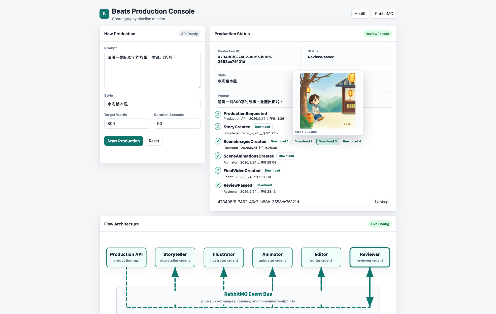

# Beats Production Choreography Demo

Language: [English](#english) | [中文](#中文)

---

## English

This repository demonstrates an event-driven, choreography-based AI agent production pipeline.

The important idea is not that every agent is already intelligent. The important idea is the integration shape: each agent is an independent worker that reacts to events, owns its own implementation, stores its own records and artifacts, and publishes the next event without directly calling the next agent.





### What This Demo Shows

- `Event-driven integration`: RabbitMQ is the event bus. Services communicate by publishing and subscribing to events instead of making direct service-to-service workflow calls.
- `Choreography over orchestration`: there is no central orchestrator that commands every step. The flow emerges from event subscriptions and publications.
- `Agent autonomy`: Storyteller, Illustrator, Animator, Editor, and Reviewer can each evolve independently. Their internal implementation can be dummy code, local LLM calls, ComfyUI image generation, cloud AI calls, or any future skill implementation.
- `Config-driven flow topology`: `flows/production-flow.json` defines who publishes which event, who subscribes to it, and what event can happen next.
- `Shared contract, independent capability`: all events use a common payload shape, while each agent decides how to interpret the event and produce its own artifact.
- `Observable demo pipeline`: every production records events, agent runs, and artifacts so the choreography can be inspected end to end.

### Conceptual Flow

```text
Production API
  publishes ProductionRequested

Storyteller
  subscribes to ProductionRequested
  writes story artifact
  publishes StoryCreated

Illustrator
  subscribes to StoryCreated
  writes scene image artifacts
  publishes SceneImagesCreated

Animator
  subscribes to SceneImagesCreated
  writes animation artifact
  publishes SceneAnimationsCreated

Editor
  subscribes to SceneAnimationsCreated
  writes final video artifact
  publishes FinalVideoCreated

Reviewer
  subscribes to FinalVideoCreated
  writes review artifact
  publishes ReviewPassed
```

Each line is replaceable. For example, the Illustrator can start as a dummy text-file enricher, then later call ComfyUI, Azure AI, or another image generation service without changing how the rest of the pipeline communicates with it.

### Flow Configuration

The choreography topology lives in:

```text
flows/production-flow.json
```

This file describes each event as a business flow definition:

```text
which service publishes an event
which services subscribe to that event
which event is expected after the subscribers complete their work
which stage, attributes, artifacts, and data belong to that event
```

The same JSON file is mounted into every .NET service at `/app/flows`. If you only change subscriptions or publications, you do not need to rebuild the images. Restart the related services so RabbitMQ bindings and MassTransit consumers are recreated:

```bash
docker compose restart production-api storyteller-agent illustrator-agent animator-agent editor-agent reviewer-agent
```

### DI And Choreography Decoupling

`production-flow.json` is loaded by `Production.Flows` and exposed through dependency injection as `IProductionFlow`.

That means agents do not hardcode the full business process. At startup, each service declares its role, such as `storyteller-agent`. The flow module finds that role's subscriptions, registers the matching MassTransit consumer, and lets the consumer ask `IProductionFlow` which event should be published next.

The responsibility split is:

- `Production.Contracts`: shared events, common payload, and contracts. This is the shared rulebook.
- `Production.Flows`: loads `production-flow.json` and exposes the active choreography topology through DI.
- `Production.Middleware`: shared adapters for RabbitMQ, artifact storage, database persistence, and AI service clients.
- `Agents.*`: capability implementations. Each agent owns its own work and should not need to know which agent comes next.

This keeps the system loosely coupled:

- The API and agents publish events to RabbitMQ.
- Agents react only to events they subscribe to.
- Flow order is controlled by configuration.
- Agent implementation can change without changing the whole pipeline.
- Adding a new agent is mainly a matter of adding a service capability and updating the flow topology.

### Flow Designer

Open:

```text
http://localhost:5088/flow-designer.html
```

The designer is a UI layer over `production-flow.json`.

It provides:

- `Event Flow Architecture`: a left-to-right flow view showing publisher, event, subscribers, and next-event direction.
- `Selected Event Profile`: an editor for the selected event's `EventType`, `Stage`, `Attributes`, `Artifacts`, and `Data`.
- `production-flow.json Preview`: live generated JSON that can be validated or exported.
- `CommonPayload Schema`: a collapsible reference for the common payload used by every event.

Saving directly back to `production-flow.json` is intentionally not enabled yet. Export the JSON, apply it to `flows/production-flow.json`, then restart the affected services.

### Requirements

Only Docker is required for the demo services.

You do not need to install these to run the containers:

```text
.NET SDK
Azure CLI
MySQL client
RabbitMQ
Azurite
```

The `LocalLLM` branch also expects Ollama and ComfyUI to run as external host services if you want real local generation.

### Optional Foundry Animator Auth

On the `LocalLLM` branch, the Animator can call an Azure AI Foundry hosted agent. Use Microsoft Entra ID credentials for normal local runs instead of pasting a short-lived bearer token.

Create a local `.env` file from `.env.example` and set these values:

```text
FOUNDRY_ANIMATOR_PROVIDER=Foundry
FOUNDRY_ANIMATOR_PROJECT_ENDPOINT=
FOUNDRY_ANIMATOR_AGENT_ID=
FOUNDRY_ANIMATOR_AGENT_NAME=
FOUNDRY_ANIMATOR_TOKEN_SCOPE=https://ai.azure.com/.default
AZURE_TENANT_ID=
AZURE_CLIENT_ID=
AZURE_CLIENT_SECRET=
```

`.env` is ignored by git. Keep the client secret local or move it to your preferred secret manager for shared environments.

### Start The Demo

From the repository root:

```bash
docker compose up -d --build
```

Check all containers:

```bash
docker compose ps
```

Expected long-running services:

```text
beats-production-api
beats-storyteller-agent
beats-illustrator-agent
beats-animator-agent
beats-editor-agent
beats-reviewer-agent
beats-rabbitmq
beats-azurite
beats-mysql
```

The `beats-storage-init` and `beats-mysql-init` containers are one-time initialization jobs. It is normal for them to exit with status `0`.

### Use The Console

Open:

```text
http://localhost:5088
```

The console can start a production, poll status, visualize the event flow, show artifacts, and link to RabbitMQ management.

### Test The API

Create a production:

```bash
curl -s -X POST http://127.0.0.1:5088/productions \
  -H 'Content-Type: application/json' \
  -d '{
    "prompt": "請說一則800字的故事，並產出影片。",
    "style": "水彩繪本風",
    "targetWordCount": 800,
    "durationSeconds": 90
  }'
```

The response contains a `productionId`:

```json
{
  "productionId": "00000000-0000-0000-0000-000000000000",
  "eventId": "00000000-0000-0000-0000-000000000000",
  "status": "Requested"
}
```

Check status:

```bash
curl -s http://127.0.0.1:5088/productions/{productionId}
```

Expected final status:

```text
ReviewPassed
```

### Inspect Runtime State

Follow service logs:

```bash
docker compose logs -f production-api storyteller-agent illustrator-agent animator-agent editor-agent reviewer-agent
```

Open RabbitMQ Management:

```text
http://localhost:15672
```

```text
username: beats
password: beats-dev
vhost: beats
```

Open MySQL:

```bash
docker exec -it beats-mysql mysql -uroot -pbeats-root-dev beats
```

Useful queries:

```sql
SELECT ProductionId, Status, CreatedAt, UpdatedAt
FROM Productions
ORDER BY CreatedAt DESC
LIMIT 5;

SELECT EventType, Producer, CreatedAt
FROM ProductionEvents
WHERE ProductionId = '{productionId}'
ORDER BY CreatedAt;

SELECT AgentRole, ArtifactUri, MediaType, CreatedAt
FROM Artifacts
WHERE ProductionId = '{productionId}'
ORDER BY CreatedAt;

SELECT AgentRole, Status, InputArtifactUri, OutputArtifactUri, StartedAt, CompletedAt
FROM AgentRuns
WHERE ProductionId = '{productionId}'
ORDER BY StartedAt;
```

### Inspect Artifacts

Artifacts are stored in the Azurite blob container:

```text
artifacts
```

Common artifact paths:

```text
productions/{productionId}/01-storyteller/story.txt
productions/{productionId}/01-storyteller/scene-breakdown.json
productions/{productionId}/01-storyteller/animation-plan.json
productions/{productionId}/02-illustrator/scene-001.png
productions/{productionId}/02-illustrator/image-manifest.json
productions/{productionId}/03-animator/animation-report.txt
productions/{productionId}/03-animator/animation-{productionIdWithoutDashes}.mp4
productions/{productionId}/04-editor/final-video.mp4
productions/{productionId}/04-editor/voiceover-script.txt
productions/{productionId}/05-reviewer/review-report.txt
```

List artifacts:

```bash
docker compose run --rm --no-deps storage-init \
  sh -c 'az storage blob list \
    --container-name artifacts \
    --connection-string "$AZURE_STORAGE_CONNECTION_STRING" \
    --prefix productions/{productionId} \
    --query "[].name" \
    -o tsv'
```

Download the final reviewer report:

```bash
docker compose run --rm --no-deps -v "$PWD:/workspace" storage-init \
  sh -c 'az storage blob download \
    --container-name artifacts \
    --name productions/{productionId}/05-reviewer/review-report.txt \
    --file /workspace/review-report.txt \
    --connection-string "$AZURE_STORAGE_CONNECTION_STRING" \
    --overwrite'
```

You can also inspect Azurite with Azure Storage Explorer. Use the local emulator option, or copy the Azurite connection string from `compose.yaml` and replace the internal host `azurite` with `127.0.0.1`.

### Stop Or Reset

Stop containers but keep persisted RabbitMQ, Azurite, and MySQL data:

```bash
docker compose down
```

Stop containers and remove persisted volumes:

```bash
docker compose down -v
```

Rebuild after code changes:

```bash
docker compose up -d --build
```

### Project Layout

```text
flows/production-flow.json  Choreography configuration file
src/Production.Api          API and UI for starting and checking productions
src/Production.Contracts    Shared events, common payload, and contracts
src/Production.Flows        Config-driven choreography topology
src/Production.Middleware   Shared event bus, artifact, persistence, and AI adapters
src/Agents.Storyteller      Storyteller capability implementation
src/Agents.Illustrator      Illustrator capability implementation
src/Agents.Animator         Animator capability implementation
src/Agents.Editor           Editor capability implementation
src/Agents.Reviewer         Reviewer capability implementation
sql/                        Database schema
docs/                       Local operation notes and images
```

### Notes

This demo is designed so each agent can start as a dummy shell and later become a real AI-powered worker without changing the event-driven integration style.

All credentials in `compose.yaml`, `.env.example`, and this README are local demo defaults only. Do not reuse them for cloud resources or shared environments.

### Supplementary: Local AI Services

Ollama and ComfyUI are not included in Docker Compose. They are treated as external AI services running on the host machine.

Containers call Ollama through:

```text
http://host.docker.internal:11434
```

Check Ollama:

```bash
curl -s http://127.0.0.1:11434/api/tags
```

The Storyteller can use an override model:

```text
STORYTELLER_OLLAMA_MODEL=hf.co/yuxinlu1/gemma-4-12B-agentic-fable5-composer2.5-v2-3.5x-tau2-GGUF:Q4_K_M
STORYTELLER_OLLAMA_TIMEOUT_SECONDS=900
STORYTELLER_OLLAMA_NUM_PREDICT=8192
```

Containers call ComfyUI through:

```text
http://host.docker.internal:8188
```

Check ComfyUI:

```bash
curl -s http://127.0.0.1:8188/system_stats
```

Default FLUX-related settings:

```text
COMFYUI_MODEL=flux1-schnell-Q4_K_S.gguf
COMFYUI_CLIP_NAME1=clip_l.safetensors
COMFYUI_CLIP_NAME2=t5xxl_fp8_e4m3fn.safetensors
COMFYUI_VAE_NAME=ae.safetensors
COMFYUI_WIDTH=768
COMFYUI_HEIGHT=768
COMFYUI_STEPS=4
COMFYUI_GUIDANCE=3.5
COMFYUI_MAX_SCENES=3
```

### Supplementary: Technology Stack

```text
.NET 8
ASP.NET Core Minimal API
MassTransit
RabbitMQ
MySQL
Azurite
Azure Blob Storage SDK
Docker Compose
Ollama, optional external local LLM runtime on LocalLLM branch
ComfyUI / FLUX, optional external local image generation runtime on LocalLLM branch
```

Service ports:

```text
Production API: http://localhost:5088
RabbitMQ AMQP: localhost:5672
RabbitMQ UI:   http://localhost:15672
Azurite Blob:  http://localhost:10000
Azurite Queue: http://localhost:10001
Azurite Table: http://localhost:10002
MySQL:         localhost:3306
```

---

## 中文

這個 repository 示範的是一套 event-driven、choreography-based 的 AI agent production pipeline。

重點不是每個 agent 現在都已經很聰明，而是整合架構：每個 agent 都是獨立 worker，收到事件後執行自己的能力、記錄自己的執行狀態、產出自己的 artifact，最後發布下一個事件，而不是直接呼叫下一個 agent。


### 這個 Demo 想表達什麼

- `Event-driven integration`：RabbitMQ 是 event bus。服務之間透過 event publish / subscribe 溝通，而不是彼此直接呼叫。
- `Choreography over orchestration`：沒有中央 orchestrator 逐步命令每個 agent。流程是由事件訂閱與發布自然串起來。
- `Agent autonomy`：說書人、繪圖師、動畫師、剪輯師、審查者都可以各自實作與演進。內部可以是 dummy code、Ollama、ComfyUI、雲端 AI，或未來任何 agent skill。
- `Config-driven flow topology`：`flows/production-flow.json` 定義誰發布 event、誰訂閱 event，以及後續會發生什麼 event。
- `Shared contract, independent capability`：所有 event 使用共用 payload schema，但每個 agent 可以用自己的方式解讀事件並產出 artifact。
- `Observable demo pipeline`：每次 production 都會記錄 events、agent runs、artifacts，方便檢查整個 choreography 是否正確流動。

### 概念流程

```text
Production API
  發布 ProductionRequested

Storyteller
  訂閱 ProductionRequested
  產出故事 artifact
  發布 StoryCreated

Illustrator
  訂閱 StoryCreated
  產出場景圖片 artifacts
  發布 SceneImagesCreated

Animator
  訂閱 SceneImagesCreated
  產出動畫 artifact
  發布 SceneAnimationsCreated

Editor
  訂閱 SceneAnimationsCreated
  產出最終影片 artifact
  發布 FinalVideoCreated

Reviewer
  訂閱 FinalVideoCreated
  產出審查 artifact
  發布 ReviewPassed
```

每一段能力都可以替換。例如 Illustrator 一開始可以只是 dummy text-file enricher，之後再改成呼叫 ComfyUI、Azure AI 或其他圖片生成服務，而不用改變整套 pipeline 的通訊方式。

### Flow Config

choreography 拓樸定義在：

```text
flows/production-flow.json
```

這份檔案把每個 event 當成一筆業務流程定義：

```text
哪個 service 發布這個 event
哪些 services 訂閱這個 event
訂閱者完成後預期會接續發布什麼 event
這個 event 對應的 stage、attributes、artifacts、data
```

同一份 JSON 會 mount 到每個 .NET service 的 `/app/flows`。如果只調整訂閱或發布拓樸，不需要重新 build image；restart 相關服務，讓 RabbitMQ bindings 與 MassTransit consumers 重新建立即可：

```bash
docker compose restart production-api storyteller-agent illustrator-agent animator-agent editor-agent reviewer-agent
```

### DI 與 Choreography 解耦合設計

`production-flow.json` 由 `Production.Flows` 載入，並透過 dependency injection 以 `IProductionFlow` 提供給 API 與 agents 使用。

因此 agent 不需要 hardcode 整個業務流程。啟動時，每個 service 只宣告自己的 role，例如 `storyteller-agent`。flow module 會找出這個 role 訂閱哪些 events、註冊對應的 MassTransit consumer，並讓 consumer 在完成任務後透過 `IProductionFlow` 查詢下一個要發布的 event。

分工如下：

- `Production.Contracts`：共用 events、common payload、contracts，也就是大家遵守的遊戲規則。
- `Production.Flows`：讀取 `production-flow.json`，並透過 DI 提供目前啟用的 choreography topology。
- `Production.Middleware`：RabbitMQ、artifact storage、database persistence、AI service clients 等共用 adapters。
- `Agents.*`：各 agent 自己的能力實作。agent 只需要做好自己的工作，不需要知道下一個 agent 是誰。

這讓系統維持低耦合：

- API 與 agents 只發布 event 到 RabbitMQ。
- agents 只處理自己訂閱的 event。
- flow order 由 config 決定。
- agent 內部實作可以替換，不牽動整條 pipeline。
- 要加入新 agent，主要是新增 service capability 並更新 flow topology。

### Flow Designer

開啟：

```text
http://localhost:5088/flow-designer.html
```

designer 是 `production-flow.json` 的 UI 維護介面。

它提供：

- `Event Flow Architecture`：由左到右的 flow view，呈現 publisher、event、subscribers 與 next-event direction。
- `Selected Event Profile`：編輯目前選取 event 的 `EventType`、`Stage`、`Attributes`、`Artifacts`、`Data`。
- `production-flow.json Preview`：即時產生 JSON，可 validate 或 export。
- `CommonPayload Schema`：可收合的補充資料，說明所有 event 共用的 payload schema。

目前尚未開啟直接寫回 `production-flow.json` 的功能。請先 export JSON，套用到 `flows/production-flow.json`，再 restart 受影響的服務。

### 需求

執行 demo services 只需要 Docker。

不需要額外安裝：

```text
.NET SDK
Azure CLI
MySQL client
RabbitMQ
Azurite
```

`LocalLLM` 分支若要進行真實本機生成，還需要主機上另外啟動 Ollama 與 ComfyUI。

### 可選 Foundry Animator Auth

在 `LocalLLM` 分支中，Animator 可以呼叫 Azure AI Foundry 上 hosted agent。正常本機執行時，建議使用 Microsoft Entra ID credential，不要貼短效 bearer token。

請從 `.env.example` 建立本機 `.env`，並設定：

```text
FOUNDRY_ANIMATOR_PROVIDER=Foundry
FOUNDRY_ANIMATOR_PROJECT_ENDPOINT=
FOUNDRY_ANIMATOR_AGENT_ID=
FOUNDRY_ANIMATOR_AGENT_NAME=
FOUNDRY_ANIMATOR_TOKEN_SCOPE=https://ai.azure.com/.default
AZURE_TENANT_ID=
AZURE_CLIENT_ID=
AZURE_CLIENT_SECRET=
```

`.env` 已被 git 忽略。client secret 請只留在本機；若是 shared environment，請改放到你選用的 secret manager。

### 啟動 Demo

在 repo 根目錄執行：

```bash
docker compose up -d --build
```

查看 container 狀態：

```bash
docker compose ps
```

預期會看到這些長時間執行的服務：

```text
beats-production-api
beats-storyteller-agent
beats-illustrator-agent
beats-animator-agent
beats-editor-agent
beats-reviewer-agent
beats-rabbitmq
beats-azurite
beats-mysql
```

`beats-storage-init` 和 `beats-mysql-init` 是一次性的初始化 job，結束並顯示 `Exited (0)` 是正常的。

### 使用 Console

開啟：

```text
http://localhost:5088
```

console 可以建立 production、自動輪詢狀態、視覺化 event flow、查看 artifacts，並連到 RabbitMQ Management UI。

### 測試 API

建立 production：

```bash
curl -s -X POST http://127.0.0.1:5088/productions \
  -H 'Content-Type: application/json' \
  -d '{
    "prompt": "請說一則800字的故事，並產出影片。",
    "style": "水彩繪本風",
    "targetWordCount": 800,
    "durationSeconds": 90
  }'
```

回應會包含 `productionId`：

```json
{
  "productionId": "00000000-0000-0000-0000-000000000000",
  "eventId": "00000000-0000-0000-0000-000000000000",
  "status": "Requested"
}
```

查詢狀態：

```bash
curl -s http://127.0.0.1:5088/productions/{productionId}
```

預期最終狀態：

```text
ReviewPassed
```

### 檢查 Runtime 狀態

查看服務 logs：

```bash
docker compose logs -f production-api storyteller-agent illustrator-agent animator-agent editor-agent reviewer-agent
```

開啟 RabbitMQ Management：

```text
http://localhost:15672
```

```text
username: beats
password: beats-dev
vhost: beats
```

進入 MySQL：

```bash
docker exec -it beats-mysql mysql -uroot -pbeats-root-dev beats
```

常用查詢：

```sql
SELECT ProductionId, Status, CreatedAt, UpdatedAt
FROM Productions
ORDER BY CreatedAt DESC
LIMIT 5;

SELECT EventType, Producer, CreatedAt
FROM ProductionEvents
WHERE ProductionId = '{productionId}'
ORDER BY CreatedAt;

SELECT AgentRole, ArtifactUri, MediaType, CreatedAt
FROM Artifacts
WHERE ProductionId = '{productionId}'
ORDER BY CreatedAt;

SELECT AgentRole, Status, InputArtifactUri, OutputArtifactUri, StartedAt, CompletedAt
FROM AgentRuns
WHERE ProductionId = '{productionId}'
ORDER BY StartedAt;
```

### 檢查 Artifacts

Artifacts 會存放在 Azurite blob container：

```text
artifacts
```

常見 artifact paths：

```text
productions/{productionId}/01-storyteller/story.txt
productions/{productionId}/01-storyteller/scene-breakdown.json
productions/{productionId}/01-storyteller/animation-plan.json
productions/{productionId}/02-illustrator/scene-001.png
productions/{productionId}/02-illustrator/image-manifest.json
productions/{productionId}/03-animator/animation-report.txt
productions/{productionId}/03-animator/animation-{productionIdWithoutDashes}.mp4
productions/{productionId}/04-editor/final-video.mp4
productions/{productionId}/04-editor/voiceover-script.txt
productions/{productionId}/05-reviewer/review-report.txt
```

列出 artifacts：

```bash
docker compose run --rm --no-deps storage-init \
  sh -c 'az storage blob list \
    --container-name artifacts \
    --connection-string "$AZURE_STORAGE_CONNECTION_STRING" \
    --prefix productions/{productionId} \
    --query "[].name" \
    -o tsv'
```

下載 reviewer 最終報告：

```bash
docker compose run --rm --no-deps -v "$PWD:/workspace" storage-init \
  sh -c 'az storage blob download \
    --container-name artifacts \
    --name productions/{productionId}/05-reviewer/review-report.txt \
    --file /workspace/review-report.txt \
    --connection-string "$AZURE_STORAGE_CONNECTION_STRING" \
    --overwrite'
```

也可以用 Azure Storage Explorer 查看 Azurite。使用 local emulator 選項，或從 `compose.yaml` 複製 Azurite connection string，並把內部 host `azurite` 改成 `127.0.0.1`。

### 停止或重置

停止 containers，但保留 RabbitMQ、Azurite、MySQL 資料：

```bash
docker compose down
```

停止 containers 並刪除 persisted volumes：

```bash
docker compose down -v
```

程式碼修改後重新 build：

```bash
docker compose up -d --build
```

### 專案結構

```text
flows/production-flow.json  choreography 設定檔
src/Production.Api          建立與查詢 productions 的 API / UI
src/Production.Contracts    共用 events、common payload、contracts
src/Production.Flows        config-driven choreography topology
src/Production.Middleware   共用 event bus、artifact、persistence、AI adapters
src/Agents.Storyteller      說書人能力實作
src/Agents.Illustrator      繪圖師能力實作
src/Agents.Animator         動畫師能力實作
src/Agents.Editor           剪輯師能力實作
src/Agents.Reviewer         審查者能力實作
sql/                        database schema
docs/                       本機操作文件與圖片
```

### 備註

這個 demo 的設計目標是：每個 agent 可以先是 dummy shell，之後再逐步變成真正的 AI-powered worker，同時不改變 event-driven 的整合方式。

`compose.yaml`、`.env.example` 和本 README 裡的帳密都是本機 demo 預設值。請不要把這些值用在 cloud resources 或 shared environments。

### 補充資料：本機 AI Services

Ollama 與 ComfyUI 不包含在 Docker Compose 內。它們被視為主機上另外運行的外部 AI services。

containers 透過這個位址呼叫 Ollama：

```text
http://host.docker.internal:11434
```

確認 Ollama：

```bash
curl -s http://127.0.0.1:11434/api/tags
```

Storyteller 可以使用獨立模型設定：

```text
STORYTELLER_OLLAMA_MODEL=hf.co/yuxinlu1/gemma-4-12B-agentic-fable5-composer2.5-v2-3.5x-tau2-GGUF:Q4_K_M
STORYTELLER_OLLAMA_TIMEOUT_SECONDS=900
STORYTELLER_OLLAMA_NUM_PREDICT=8192
```

containers 透過這個位址呼叫 ComfyUI：

```text
http://host.docker.internal:8188
```

確認 ComfyUI：

```bash
curl -s http://127.0.0.1:8188/system_stats
```

預設 FLUX 相關設定：

```text
COMFYUI_MODEL=flux1-schnell-Q4_K_S.gguf
COMFYUI_CLIP_NAME1=clip_l.safetensors
COMFYUI_CLIP_NAME2=t5xxl_fp8_e4m3fn.safetensors
COMFYUI_VAE_NAME=ae.safetensors
COMFYUI_WIDTH=768
COMFYUI_HEIGHT=768
COMFYUI_STEPS=4
COMFYUI_GUIDANCE=3.5
COMFYUI_MAX_SCENES=3
```

### 補充資料：技術堆疊

```text
.NET 8
ASP.NET Core Minimal API
MassTransit
RabbitMQ
MySQL
Azurite
Azure Blob Storage SDK
Docker Compose
Ollama，LocalLLM branch 可選外部本機 LLM runtime
ComfyUI / FLUX，LocalLLM branch 可選外部本機圖片生成 runtime
```

服務 ports：

```text
Production API: http://localhost:5088
RabbitMQ AMQP: localhost:5672
RabbitMQ UI:   http://localhost:15672
Azurite Blob:  http://localhost:10000
Azurite Queue: http://localhost:10001
Azurite Table: http://localhost:10002
MySQL:         localhost:3306
```
